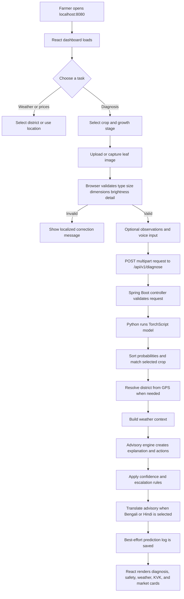
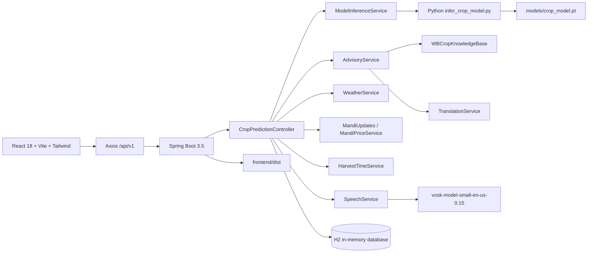

# FasalSathi

## AI Crop Disease Advisor for West Bengal Farmers

FasalSathi is a farmer-first agricultural decision-support platform for West Bengal. It combines crop-leaf image analysis, explainable treatment guidance, local-language assistance, district-aware weather context, mandi price discovery, harvest planning, KVK support, and offline voice transcription in one responsive web application.

The project is designed for field use: a farmer can open one URL, select a crop and growth stage, upload a clear leaf photograph, describe what they see, and receive a practical advisory with confidence, alternative possibilities, safety warnings, weather impact, and escalation guidance.

> **Hackathon pitch:** FasalSathi turns a difficult crop-health question into a clear next action, in a language and format that farmers can use immediately.

## Contents

- [Why FasalSathi](#why-fasalsathi)
- [Problem and solution](#problem-and-solution)
- [Key capabilities](#key-capabilities)
- [End-to-end workflow](#end-to-end-workflow)
- [System architecture](#system-architecture)
- [Repository structure](#repository-structure)
- [Feature details](#feature-details)
- [API reference](#api-reference)
- [Backend function reference](#backend-function-reference)
- [Frontend function reference](#frontend-function-reference)
- [Data, model, and safety design](#data-model-and-safety-design)
- [Local setup](#local-setup)
- [Configuration](#configuration)
- [Demo script](#demo-script)
- [Testing and verification](#testing-and-verification)
- [Limitations and responsible use](#limitations-and-responsible-use)
- [Roadmap](#roadmap)
- [Team-ready project summary](#team-ready-project-summary)

## Why FasalSathi

Small and marginal farmers often face a gap between noticing a symptom and finding trustworthy, understandable help. Existing tools may be difficult to use in the field, written only in English, disconnected from local conditions, focused on a model label rather than a safe action plan, or dependent on a network and specialist being immediately available.

FasalSathi addresses that gap by combining machine learning with a West Bengal agricultural knowledge layer. The model proposes likely conditions, while the advisory engine adds context, treatment steps, safety rules, and a clear threshold for expert consultation.

## Problem and solution

| Farmer need | FasalSathi response |
| --- | --- |
| Identify a possible crop disease | TorchScript crop model returns sorted class probabilities |
| Understand whether the result is reliable | Shows confidence, diagnosis type, top alternatives, and escalation status |
| Know what to do next | Builds IPDM organic, chemical (with stage dosage), and preventive action groups |
| Avoid unsafe spraying | Adds PPE, pre-harvest interval, drift, hygiene, and child/animal warnings |
| Get advice in a familiar language | Supports English, Bengali, and Hindi UI/advisory output |
| Adapt advice to the field | Uses crop, growth stage, district, GPS, observations, and weather context |
| Check prices before selling | Uses official mandi data when configured and local estimates otherwise |
| Know when to harvest | Provides crop-specific windows, maturity indicators, and current relevance |
| Find local follow-up support | Returns the nearest matching KVK and contact information |
| Track 7-day follow-up checks | Schedules automated `FollowUpTask` with home screen countdown alert banner |
| Log pest trap counts | Records manual & sensor trap observations (`/pest-log`) |
| View regional pest & disease clusters | Interactive 14-day West Bengal district hotspot surveillance map (`/hotspots`) |
| State agriculture oversight | Official admin dashboard (`/admin/dashboard`) with trend charts & lab review queue |
| Ground-truth ML confirmation | Field accuracy rating widget for continuous ML learning (`/diagnosis-feedback`) |
| KVK Laboratory referral | Direct ticket escalation for ambiguous crop samples (`/referrals`) |
| Use the product hands-free | Records audio in the browser and transcribes it with Vosk |

## Key capabilities

### 1. Explainable crop diagnosis

- Accepts JPG, PNG, and WebP leaf images.
- Rejects unsupported formats, images above 10 MB, unreadable files, very small images, dark/overexposed images, and images without enough visible detail.
- Supports crop type, growth stage, district, latitude, longitude, and free-text observations.
- Runs a TorchScript model through a Python inference script.
- Sorts model probabilities from highest to lowest and returns the top three candidates.
- Filters predictions to the selected crop when possible.
- Labels results as `DEFINITIVE_DIAGNOSIS`, `ADVISORY_SUPPORT`, or `IMAGE_NOT_MATCHED`.
- Does not force a treatment when the selected crop cannot be matched confidently.

### 2. Action-oriented advisories & IPDM

Every matched disease advisory includes Integrated Pest & Disease Management (IPDM) steps: cultural/biological steps before chemical controls, exact pesticide dosage per growth stage, plain-language explanation, symptoms to verify, weather impact, safety warnings, solution summary, and expert-escalation guidance.

### 3. West Bengal localization

The built-in knowledge base contains 23 West Bengal districts, coordinates, agro-climatic zones, soil types, major crops, KVK names and contacts, crop stages, crop seasons, common disease mappings, advisory templates, and seasonal harvest guidance.

### 4. Weather-aware field planning & risk forecasting

The weather service returns temperature, humidity, rain, wind, condition, district, location, 3-day forecast, and micro-climate disease risk scores (`GET /api/v1/farms/{id}/risk-forecast`). The advisory engine uses weather context to warn about humidity, rainfall, canopy moisture, and spray timing.

### 5. Follow-Up Task Monitoring & Home Screen Banner

Upon diagnosis, a 7-day field check-in task (`FollowUpTask`) is automatically created (`dueDate = LocalDate.now().plusDays(7)`). The home screen (`HomePage.jsx`) displays a prominent, dismissible countdown banner alerting farmers to upcoming or overdue inspections with one-click "Mark Completed" (`✓`) and "Inspect Field" (`🔍`) actions.

### 6. Geospatial Hotspot Surveillance Map (`/hotspots`)

Aggregates 14-day field diagnoses and trap counts into GeoJSON district clusters (`GET /api/v1/hotspots`). The interactive map page (`HotspotsPage.jsx`) features color-coded risk markers (Red >10 cases, Yellow 5-10, Green <5), crop/timeframe filter toolbars, and a selected district detail drawer.

### 7. Official Agriculture Admin Dashboard (`/admin/dashboard`)

Executive surveillance portal for state and district agriculture officials. Features 4 top KPI cards (Active Hotspots, Pending Reviews, Follow-Up Compliance Rate %, Total Reports), visual SVG district disease incident breakdown charts, 14-day trapping trend graphs, and an interactive KVK Expert & Laboratory Review Queue.

### 8. Ground-Truth ML Feedback & KVK Lab Referrals

- **Ground-Truth Feedback**: Field workers confirm diagnosis accuracy directly on `DiagnosePage.jsx` (`/api/v1/diagnosis-feedback`) for continuous model refinement.
- **KVK Lab Referral**: Extension workers escalate ambiguous or high-risk leaf samples to Krishi Vigyan Kendra laboratories with instant ticket tracking numbers (`/api/v1/referrals`).

### 9. Mandi prices and harvest planning

Supports district-aware mandi records, 5-minute in-memory caching, optional `data.gov.in` API enrichment, and harvest planning for 11 West Bengal crops.

### 10. Local languages and voice

- UI language choices: English, Bengali, Hindi.
- Backend translation templates cover diagnosis labels, common disease names, crop names, stages, safety phrases, and action fragments.
- Browser microphone capture with Vosk local speech recognition.

### 11. Farmer planning tools

Includes district selection, geolocation, weather/market/nearby-shop tabs, device-local crop and storage records, planting/harvest dates, and a profit calculator.

## End-to-end workflow



### Diagnosis request sequence

1. `DiagnosePage` loads crop and district metadata from `/api/v1/crops` and `/api/v1/districts`.
2. The farmer selects the crop and growth stage.
3. `FileUpload` passes the selected file to `handleFileSelect`.
4. The browser checks MIME type, file size, dimensions, brightness, variance, and color detail.
5. Optional browser geolocation fills latitude and longitude.
6. Optional microphone capture sends audio to `/api/v1/speech/transcribe`.
7. The frontend builds `FormData` and calls `/api/v1/diagnose`.
8. `CropPredictionController.diagnose` invokes model inference.
9. If no district was selected but GPS coordinates exist, the nearest West Bengal district is resolved.
10. Weather context is generated from the selected or resolved coordinates.
11. `AdvisoryService.buildAdvisory` creates the complete explainable response.
12. The response is translated when the selected language is Bengali or Hindi.
13. The response is stored in `PredictionLog` when persistence succeeds; logging failure does not block the farmer response.
14. The UI renders confidence, alternatives, solution summary, grouped actions, warnings, weather impact, and escalation information.

## System architecture



### Runtime topology

- React is built into `frontend/desktop-tutorial/frontend/dist`.
- Spring Boot serves that build from `frontend/dist/` relative to the backend working directory.
- Spring Boot owns port `8080` for both the website and API.
- The canonical URL is `http://localhost:8080`.
- The launcher stops a stale port-8080 process, waits for the port to release, starts Spring Boot, waits for `/api/v1/health`, and then opens the website.

## Repository structure

```text
Agriculture-FoodTech/
|-- README.md
|-- run-app.bat                 # Canonical one-command launcher
|-- setup-and-run.bat           # Dependency checks, frontend build, backend startup
|-- build-app.bat               # Maven clean package
|-- SETUP_GUIDE.md
|-- TEST_REPORT.md
|-- plan.md
|-- frontend/
|   `-- desktop-tutorial/
|       |-- pom.xml             # Spring Boot, DJL, Vosk, H2 dependencies
|       |-- models/
|       |   |-- crop_model.pt   # TorchScript model
|       |   `-- classes.txt     # Model labels
|       |-- frontend/
|       |   |-- package.json
|       |   |-- index.html
|       |   `-- src/
|       |       |-- App.jsx
|       |       |-- api/cropApi.js
|       |       |-- context/LanguageContext.jsx
|       |       |-- components/
|       |       `-- pages/
|       |-- src/main/java/com/example/
|       |   |-- CropDiseaseApiApplication.java
|       |   |-- controller/
|       |   |-- dto/
|       |   |-- entity/
|       |   |-- repository/
|       |   `-- service/
|       `-- src/main/resources/
|           |-- application.properties
|           `-- infer_crop_model.py
`-- vosk-model-small-en-us-0.15/ # Local English speech model
```

## Feature details

### Home dashboard

`HomePage.jsx` loads districts, reads a saved profile district, optionally maps geolocation to the closest known district, updates the greeting every minute, loads weather for the weather tab, loads mandi estimates for the market tab, shows a three-day forecast, shows a seven-point indicative price trend, exposes nearby support, and links directly to diagnosis and tools.

### Diagnosis page

`DiagnosePage.jsx` owns the diagnosis workflow and result presentation.

#### Input handling

- `handleFileSelect(file)` validates the file and creates a browser preview.
- `validateImageContent(file)` checks minimum dimensions, exposure, image variance, and color detail.
- `handleLocation()` requests browser coordinates.
- Crop and stage labels are localized for all three supported languages.
- Observations are optional but are included in the advisory explanation when provided.

#### Voice handling

- Uses browser audio capture.
- Converts recorded samples to PCM WAV using `encodeWav`.
- Sends the recording through `transcribeAudio`.
- Displays recording, listening, transcribing, ready, and error states.
- Places the returned transcript into the observations workflow.

#### Result presentation

- `DiagnosisBadge`: result type and confidence status.
- `ConfidenceGauge`: visual probability display.
- `CandidateList`: top alternative conditions.
- `ActionCard`: grouped practical actions.
- `SafetyWarnings`: high-visibility safety guidance.
- `EscalationAlert`: expert referral and uncertainty explanation.
- `WeatherCard`: current conditions and forecast.
- KVK and mandi panels: local follow-up and financial context.
- New diagnosis action: clears the result and starts another analysis.

### Profile and storage

The profile and crop-storage views keep farmer-entered records on the device using browser storage. This avoids requiring an account for the local demo while allowing a farmer to remember crop, land, planting, harvest, storage, and notes.

### Tools page

The tools area exposes harvest information, market information, KVK support, crop planning, and profit estimation. The profit calculator requests `/api/v1/mandi-prices` whenever the selected crop changes, uses the first modal market price as the selling-price input, and therefore produces crop-specific revenue and profit values. It remains useful when external services are unavailable because representative local values and the built-in knowledge base provide fallback data.

## API reference

All endpoints use the `/api/v1` prefix. The frontend uses a 30-second Axios timeout.

### Health and metadata

| Method | Endpoint | Purpose |
| --- | --- | --- |
| `GET` | `/api/v1/health` | Returns service status, service name, and timestamp. Used by the launcher and connectivity checks. |
| `GET` | `/api/v1/districts` | Returns districts with coordinates, agro-climatic zone, major crops, and KVK phone. |
| `GET` | `/api/v1/crops` | Returns crop names, growth stages, seasons, and common diseases. |
| `GET` | `/api/v1/translations` | Returns the backend phrase dictionary. |

### Diagnosis and speech

#### `POST /api/v1/diagnose`

Content type: `multipart/form-data`.

| Field | Required | Description |
| --- | --- | --- |
| `image` | Yes | Leaf image. Backend requires a readable image and at least 160 x 160 pixels. |
| `cropType` | No | Selected crop, such as Rice, Potato, Tomato, or Maize. |
| `cropStage` | No | Growth stage used for relevance and action wording. |
| `district` | No | West Bengal district. |
| `latitude` | No | GPS latitude for district and weather context. |
| `longitude` | No | GPS longitude for district and weather context. |
| `observations` | No | Farmer's description of symptoms. |
| `language` | No | `en`, `bn`, or `hi`; defaults to English. |

Response fields include `diagnosisType`, `primaryDiagnosis`, `confidence`, `candidates`, `explanation`, `solutionSummary`, `nextActions`, `safetyWarnings`, `weatherImpact`, `cropStageRelevance`, `escalateToExpert`, `escalationInfo`, `translatedAdvisory`, and `districtContext`.

#### `POST /api/v1/speech/transcribe`

Content type: `multipart/form-data`.

| Field | Required | Description |
| --- | --- | --- |
| `audio` | Yes | Browser-recorded audio. |
| `language` | No | Returned as the response language marker; the bundled Vosk model is English. |

Returns `transcript`, `language`, and an `error` field when transcription fails.

### Local context and planning

| Method | Endpoint | Parameters | Purpose |
| --- | --- | --- | --- |
| `GET` | `/api/v1/weather` | `lat`, `lon` | Returns estimated field weather and a three-day forecast. |
| `GET` | `/api/v1/kvk` | `district`, `lat`, `lon` | Returns district KVK details or the nearest matching support route. |
| `GET` | `/api/v1/mandi-prices` | `crop`, `state`, `district` | Returns district-aware mandi records for the dashboard. |
| `GET` | `/api/v1/market-info/{cropName}` | path `cropName` | Returns harvest information and price records for one crop. |
| `GET` | `/api/v1/market-info` | none | Returns harvest and price information for all supported crops. |

### Surveillance, Hotspots & Admin API

| Method | Endpoint | Parameters | Purpose |
| --- | --- | --- | --- |
| `GET` | `/api/v1/hotspots` | `days` (optional) | Returns GeoJSON-style district risk cluster nodes based on 14-day field diagnoses & trap counts. |
| `GET` | `/api/v1/admin/dashboard` | none | Returns executive statistics: active hotspots, pending lab reviews, follow-up compliance rate %, district breakdown, and expert review queue. |
| `POST` | `/api/v1/pest-observations` | Body JSON | Logs manual/sensor trap count observations (`farmId`, `pestType`, `count`, `source`). |
| `GET` | `/api/v1/pest-observations` | `farmId` | Retrieves trap observation history for a farm. |

### Follow-Up & Field Interventions API

| Method | Endpoint | Parameters | Purpose |
| --- | --- | --- | --- |
| `GET` | `/api/v1/follow-ups` | `farmId` (optional) | Returns pending 7-day post-diagnosis field check-in tasks. |
| `POST` | `/api/v1/follow-ups` | Body JSON | Schedules a new follow-up task (`farmId`, `diagnosisId`, `dueDate`). |
| `PUT` | `/api/v1/follow-ups/{id}/complete` | path `id` | Marks a scheduled follow-up task as completed. |

### Ground-Truth Feedback & KVK Lab Referral API

| Method | Endpoint | Parameters | Purpose |
| --- | --- | --- | --- |
| `POST` | `/api/v1/diagnosis-feedback` | Body JSON | Submits field accuracy rating (`diagnosisId`, `isCorrect`, `verifiedDisease`, `notes`) for continuous ML refinement. |
| `POST` | `/api/v1/referrals` | Body JSON | Escalates an ambiguous or high-risk leaf sample to a KVK lab and generates a referral ticket. |

### Micro-Climate Risk Forecasting API

| Method | Endpoint | Parameters | Purpose |
| --- | --- | --- | --- |
| `GET` | `/api/v1/farms/{id}/risk-forecast` | path `id` | Scores disease risk (Low, Medium, High) for a farm's current crop based on temperature, humidity, and rainfall thresholds. |

### Example requests

```bash
curl http://localhost:8080/api/v1/health
curl http://localhost:8080/api/v1/hotspots
curl http://localhost:8080/api/v1/admin/dashboard
curl "http://localhost:8080/api/v1/weather?lat=23.25&lon=87.85"
curl "http://localhost:8080/api/v1/mandi-prices?crop=Rice&state=West%20Bengal&district=Purba%20Bardhaman"
```

Diagnosis example:

```bash
curl -X POST http://localhost:8080/api/v1/diagnose ^
	-F "image=@leaf.jpg" ^
	-F "cropType=Tomato" ^
	-F "cropStage=Flowering" ^
	-F "district=Nadia" ^
	-F "observations=Brown spots on lower leaves" ^
	-F "language=en"
```

## Backend function reference

### `CropPredictionController`

| Function | Responsibility |
| --- | --- |
| `diagnose(...)` | Coordinates inference, GPS district resolution, weather context, advisory creation, optional persistence, and response delivery. |
| `getDistricts()` | Converts district records into frontend-friendly maps. |
| `getCrops()` | Converts crop records into frontend-friendly maps. |
| `getTranslations()` | Exposes backend phrase translations. |
| `getMarketInfoForCrop(cropName)` | Combines harvest data and prices for one crop. |
| `getAllMarketInfo()` | Combines harvest data and prices for every supported crop. |
| `weather(latitude, longitude)` | Delegates to `WeatherService.getLiveWeather`. |
| `kvk(district, latitude, longitude)` | Delegates to `WBCropKnowledgeBase.getKvkDetails`. |
| `mandiPrices(crop, state, district)` | Requests up to eight dashboard market records. |
| `transcribe(audio, language)` | Calls `SpeechService` and returns structured errors. |
| `health()` | Returns a lightweight readiness response. |
| `parseDouble(value)` | Safely parses optional coordinate strings. |

### Executive & Surveillance Controllers

| Controller | Endpoint(s) | Responsibility |
| --- | --- | --- |
| `DashboardController` | `GET /api/v1/admin/dashboard` | Aggregates state-level KPIs, district disease breakdown, 14-day trends, and pending KVK lab review items. |
| `FieldController` / `HotspotController` | `GET /api/v1/hotspots` | Generates 14-day GeoJSON district risk node clusters from diagnoses and trap counts. |
| `FollowUpTaskController` | `GET / POST / PUT /api/v1/follow-ups` | Schedules, lists, and completes 7-day post-diagnosis field check-in tasks. |
| `FarmController` | `GET /api/v1/farms/{id}/risk-forecast`, `POST /api/v1/pest-observations` | Evaluates micro-climate disease risk thresholds and logs trap observation records. |
| `ReferralController` | `POST /api/v1/referrals` | Creates KVK laboratory referral escalation tickets. |
| `AgronomicRecommendationController` | `POST /api/v1/diagnosis-feedback` | Collects field-verified diagnosis feedback for continuous ML model training. |

### `ModelInferenceService`

| Function | Responsibility |
| --- | --- |
| Constructor | Resolves the model path, sibling `classes.txt`, and packaged Python script. |
| `resolveClassNames(...)` | Uses configured labels or reads non-empty labels from `classes.txt`. |
| `resolvePythonScriptPath()` | Copies `infer_crop_model.py` from classpath resources to a temporary file. |
| `predict(image)` | Validates the image and model, writes a temporary PNG, starts Python inference, parses JSON probabilities, sorts them, and deletes the temporary image. |
| `resolvePythonExecutable()` | Checks `PYTHON_EXE`, known Windows Python paths, `python`, `python3`, and the `py` launcher. |

### `AdvisoryService`

| Function | Responsibility |
| --- | --- |
| `buildAdvisory(...)` | Main pipeline from probabilities to localized, weather-aware, safety-aware response. |
| `matchesCrop(...)` | Matches labels to the selected crop, including Brinjal/Eggplant and Chilli/Pepper aliases. |
| `imageNotMatchedResponse(...)` | Returns a safe no-treatment result for a crop mismatch. |
| `buildExplanation(...)` | Combines confidence, disease description, cause, symptoms, stage, and observations. |
| `buildNextActions(...)` | Creates organic (cultural/biological), chemical (with growth-stage dosage), preventive, and weather-aware IPDM actions. |
| `buildSolutionSummary(...)` | Produces a short treatment summary for the result card. |
| `buildSafetyWarnings(...)` | Adds PPE, pre-harvest, hygiene, child/animal, and spray-timing warnings. |
| `buildCropStageRelevance(...)` | Explains why growth stage changes urgency and treatment caution. |
| `buildEscalationInfo(...)` | Explains when and why to contact a KVK or expert. |
| `buildTranslation(...)` | Builds the Bengali/Hindi translated advisory object. |
| `hasMixedSignals(...)` | Detects close competing candidates and contributes to escalation. |

### Confidence and escalation rules

- Confidence at or above `0.70`: `DEFINITIVE_DIAGNOSIS`.
- Confidence below `0.70`: `ADVISORY_SUPPORT`.
- Confidence below `0.50`: expert escalation is recommended.
- Escalation is also recommended when an advisory requires confirmation or top candidates contain mixed signals.
- The top three crop-matched candidates are returned for transparency.

### Supporting services

| Service | Public functions and behavior |
| --- | --- |
| `HotspotService` | `getHotspots(days)` aggregates diagnoses and trap counts into GeoJSON district risk clusters. |
| `WBCropKnowledgeBase` | `getAllDistricts`, `getDistrict`, `getKvkDetails`, `findNearestDistrict`, `getAllCrops`, `getCrop`, `getDiseaseAdvisory`, `getCurrentSeason`, and `getDistrictContext`. |
| `WeatherService` | `getLiveWeather` builds district-aware conditions and forecast; `getWeatherContext` converts them into advisory text; `calculateDiseaseRisk(farm, weather)` scores crop-specific risk. |
| `MandiUpdates` | `getLivePrices` returns dashboard records with official-data enrichment and local fallback; `getUpdates` supports older callers. |
| `MandiPriceService` | `getPrices` uses a five-minute cache, official commodity mapping, API access, and representative fallback prices; `getAllPrices` and `isLiveApiAvailable` support overview screens. |
| `HarvestTimeService` | `getHarvestInfo` returns one crop's season and indicators; `getAllHarvestInfo` returns all; `getAvailableCrops` lists supported crops. |
| `TranslationService` | `translateDiseaseName`, `translate`, `translateActions`, and `getAllPhrases` provide offline templates. |
| `SpeechService` | `transcribe` resolves Vosk, converts audio to 16 kHz mono PCM, runs recognition, and extracts text. |

## Frontend function reference

### Application shell

| File | Responsibility |
| --- | --- |
| `App.jsx` | Wraps the app in `ErrorBoundary`, renders `Navbar` and `Footer`, and routes `/`, `/diagnose`, `/hotspots`, `/admin/dashboard`, `/pest-log`, `/tools`, `/about`, and `/profile`. Unknown routes return home. |
| `main.jsx` | Mounts React and global styles. |
| `LanguageContext.jsx` | Stores active language and exposes translation access. |
| `Navbar.jsx` | Navigation links and language switching. |
| `Footer.jsx` | Navigation, support links, version, and project identity. |
| `ErrorBoundary.jsx` | Prevents an unexpected component error from blanking the interface. |

### API client: `cropApi.js`

| Function | HTTP call |
| --- | --- |
| `diagnose(image, metadata)` | Builds multipart data and posts to `/diagnose`, omitting empty metadata. |
| `transcribeAudio(audioBlob, language)` | Posts WAV audio and language to `/speech/transcribe`. |
| `getDistricts()` | Gets `/districts`. |
| `getCrops()` | Gets `/crops`. |
| `getTranslations()` | Gets `/translations`. |
| `getWeather(latitude, longitude)` | Gets `/weather` with coordinates. |
| `getKvkInfo(district, latitude, longitude)` | Gets `/kvk`. |
| `getMandiPrices(crop, state, district)` | Gets `/mandi-prices` with filters. |
| `getHotspots(days)` | Gets `/hotspots`. |
| `getAdminDashboard()` | Gets `/admin/dashboard`. |
| `submitDiagnosisFeedback(feedback)` | Posts to `/diagnosis-feedback`. |
| `createReferral(referral)` | Posts to `/referrals`. |
| `getPestObservations(farmId)` | Gets `/pest-observations`. |
| `createPestObservation(data)` | Posts to `/pest-observations`. |
| `getFollowUpTasks(farmId)` | Gets `/follow-ups`. |
| `completeFollowUpTask(id)` | Puts `/follow-ups/{id}/complete`. |
| `healthCheck()` | Gets `/health`. |

### Reusable components & views

| Component | Function |
| --- | --- |
| `HomePage` | Home dashboard with 7-day follow-up countdown banner, weather, mandi prices, and quick navigation. |
| `DiagnosePage` | AI leaf diagnosis, IPDM recommendations, ground-truth feedback, and KVK lab referral. |
| `HotspotsPage` | Interactive West Bengal geospatial risk cluster map with filters and district detail drawer. |
| `OfficialDashboard` | Executive agriculture dashboard with KPI cards, SVG charts, and expert review queue. |
| `PestLogPage` | Manual & sensor pest-trap observation entry form. |
| `FileUpload` | Image selection and upload interaction. |
| `LoadingSpinner` | Consistent loading state. |
| `DiagnosisBadge` | Diagnosis type and status label. |
| `ConfidenceGauge` | Confidence visualization. |
| `CandidateList` | Alternative conditions and probabilities. |
| `ActionCard` | Grouped IPDM action-plan rendering (Cultural, Biological, Chemical, Preventive). |
| `SafetyWarnings` | High-visibility PPE, pre-harvest, hygiene, and environmental safety guidance. |
| `EscalationAlert` | Expert referral and uncertainty explanation. |
| `WeatherCard` | Current conditions and forecast. |
| `CropStorage` | Farmer crop and storage records. |

## Data, model, and safety design

### Model execution

1. The frontend sends the image as multipart data.
2. Spring validates that the file exists and can be decoded.
3. The model service writes a temporary PNG.
4. Java starts `infer_crop_model.py` with model, labels, and image paths.
5. Python returns JSON probabilities on standard output.
6. Java validates the output and sorts it into a deterministic ordered map.
7. The temporary input is deleted in a `finally` block.

### Crop matching

The model may know disease classes across several crops. The advisory engine uses the farmer's selected crop as evidence and filters labels using normalized crop names. This prevents a high-probability disease from an unrelated crop being presented as the final answer.

### Safety by design

FasalSathi is decision support, not a replacement for a qualified agronomist. It distinguishes advisory support from a definitive result, avoids treatment when the image does not match, surfaces alternatives, includes pre-harvest intervals, recommends PPE and hygiene, warns about children, animals, drift, heat, and pollinators, recommends expert confirmation for low confidence, and tells users to verify market values before selling.

### Persistence

Prediction logs use an H2 in-memory database for local development. The response remains successful even if logging fails. This keeps the demo reliable while leaving a clear boundary for a future PostgreSQL or managed database implementation.

## Local setup

### Requirements

- Windows for the provided `.bat` launchers.
- Java JDK 25 or later.
- Maven 3.9 or later.
- Node.js 20 or later with npm.
- Python 3 with the packages required by `requirements-training.txt` for crop inference.
- The bundled TorchScript model and Vosk model.

### One-command launch

From the repository root:

```bat
run-app.bat
```

The launcher checks Java, Maven, Node, and npm; installs frontend packages with `npm ci --legacy-peer-deps` on first run; builds React; verifies the generated bundles; stops a stale port-8080 process; waits for release; starts Spring Boot; polls `/api/v1/health`; and opens `http://localhost:8080`.

### Separate app links

- **Automatic app:** `http://localhost:8080/` detects phone versus desktop width.
- **Mobile app override:** `http://localhost:8080/?mode=mobile`
- **PC workspace override:** `http://localhost:8080/?mode=desktop`

The automatic link uses a narrower, touch-friendly layout on phones and the wider desktop workspace on PCs. The query links override detection when needed. All modes use the same backend and farmer data.

### Manual development commands

```bat
cd frontend\desktop-tutorial\frontend
npm ci --legacy-peer-deps
npm run build

cd ..
mvn clean package
mvn spring-boot:run
```

The frontend build must exist at `frontend\desktop-tutorial\frontend\dist` before Spring Boot serves the website.

## Configuration

Configuration is in `frontend/desktop-tutorial/src/main/resources/application.properties`.

| Variable | Default | Purpose |
| --- | --- | --- |
| `SERVER_PORT` | `8080` | Spring Boot HTTP port. |
| `CROP_MODEL_PATH` | `models/crop_model.pt` | TorchScript model path relative to the backend working directory. |
| `CROP_MODEL_CLASSES` | empty | Optional comma-separated model labels; empty reads `models/classes.txt`. |
| `PYTHON_EXE` | auto-detected | Optional absolute Python executable for inference. |
| `MANDI_API_KEY` | empty | Optional `data.gov.in` API key. |
| `MANDI_RESOURCE_ID` | configured resource ID | Optional official mandi resource. |
| `MANDI_BASE_URL` | `https://api.data.gov.in` | Dashboard mandi integration base URL. |
| `OPENWEATHER_API_KEY` | empty | Reserved weather configuration; local field estimates remain available. |
| `WEATHER_BASE_URL` | Open-Meteo URL | Weather service base URL configuration. |
| `TRANSLATION_API_URL` | Google Translate-compatible endpoint | Translates complete Bengali/Hindi diagnosis narratives; local glossary is used when unavailable. |

Example PowerShell session:

```powershell
$env:MANDI_API_KEY = "your-data-gov-api-key"
$env:PYTHON_EXE = "C:\Python312\python.exe"
& .\run-app.bat
```

Never commit API keys.

## Demo script

1. Launch `run-app.bat` and open `http://localhost:8080`.
2. Select a West Bengal district or use location.
3. Show the weather card and farmer task reminder.
4. Switch to market prices and explain official-data/fallback behavior.
5. Open **Diagnose**.
6. Select Tomato and Flowering.
7. Upload a clear leaf image and add an observation such as `brown spots on lower leaves`.
8. Run analysis.
9. Show diagnosis type, confidence, alternatives, explanation, and solution summary.
10. Highlight organic, chemical, and preventive actions.
11. Highlight PPE, pre-harvest interval, spray timing, and escalation guidance.
12. Switch to Bengali or Hindi.
13. Use voice input to demonstrate hands-free observation capture.
14. Open tools or profile to show harvest planning, profit estimation, and crop storage.

> FasalSathi does not stop at naming a disease. It connects visual evidence to crop stage, local conditions, safe actions, market context, and human expert support, so the farmer knows what to do next and when not to act alone.

## Testing and verification

### Smoke checks

```bash
curl http://localhost:8080/api/v1/health
curl http://localhost:8080/api/v1/districts
curl http://localhost:8080/api/v1/crops
```

Expected health response shape:

```json
{
	"status": "UP",
	"service": "FasalSathi",
	"timestamp": 0
}
```

The timestamp is generated at runtime and will not literally be zero.

### Manual acceptance checklist

- [ ] `run-app.bat` starts without a second frontend server.
- [ ] `http://localhost:8080` renders the React home page.
- [ ] `/api/v1/health` returns `status: UP`.
- [ ] Districts and crops load in the diagnosis form.
- [ ] Invalid images are rejected before upload.
- [ ] Valid diagnosis returns confidence and candidates.
- [ ] Low-confidence or mixed-signal results show escalation guidance.
- [ ] Bengali and Hindi controls update the visible experience.
- [ ] Weather, mandi, KVK, and harvest sections show fallback data without API keys.
- [ ] Voice transcription reports a clear error when the Vosk model or microphone is unavailable.
- [ ] Profile and crop-storage data survive a page refresh in the same browser.

## Limitations and responsible use

- The current weather response is a field estimate and should not replace official alerts.
- Market values may be representative estimates when the official API is unavailable. Confirm prices locally before selling.
- The bundled speech model is English; Bengali and Hindi UI translation does not mean the Vosk model recognizes those languages.
- Model output is advisory support. Consult a KVK or agriculture expert before high-risk chemical treatment, especially when confidence is low.
- The local H2 database is in memory and intended for development/demo use.
- Supported model classes depend on `models/classes.txt` and the supplied TorchScript model.
- Production deployment should add authentication, persistent storage, HTTPS, rate limits, observability, and managed secrets.

## Roadmap

1. Add production database and farmer account synchronization.
2. Add Bengali and Hindi speech models.
3. Add more verified disease classes and region-specific datasets.
4. Add image and prediction audit tools for agronomists.
5. Add official weather alerts and government advisories.
6. Add offline-first synchronization for low-connectivity areas.
7. Add cloud deployment manifests.
8. Add automated API, model-contract, accessibility, and browser end-to-end tests.

## Team-ready project summary

### Project name

**FasalSathi: AI Crop Disease Advisor for West Bengal Farmers**

### Category

Agriculture technology, responsible AI, rural accessibility, and decision support.

### Target users

Small and marginal farmers, local agriculture workers, KVK staff, and field volunteers in West Bengal.

### Core innovation

An explainable, multilingual, district-aware workflow that combines crop image inference with practical agronomy, safety constraints, market context, harvest timing, and escalation to local human support.

### Technology stack

- React 18, Vite 5, Tailwind CSS, and Axios
- Spring Boot 3.5 and Java 25
- Python inference bridge and TorchScript crop model
- DJL/PyTorch dependencies
- Vosk speech recognition
- H2 database and Maven

### Impact hypothesis

If a farmer can receive an understandable, locally relevant, safety-aware next step within seconds of noticing a leaf symptom, they can respond earlier, reduce avoidable crop loss, avoid unnecessary chemical use, and reach expert support with better information.

### Responsible AI position

FasalSathi intentionally communicates uncertainty. It does not present every model output as a fact, does not recommend treatment when the crop does not match, and provides a human escalation path when confidence or evidence is insufficient.

### Model coverage and confidence note

The bundled classifier currently contains Potato, Tomato, Pepper/Chilli, Corn/Maize, Apple, Grape, and related disease labels. The diagnosis form therefore exposes only the bundled model's supported West Bengal crops: Potato, Tomato, Chilli, and Maize. Broader crops remain available in market, harvest, and planning tools. The repository's two image fixtures are synthetic low-detail images and are rejected before inference; they must not be used to judge model accuracy. Retraining is recommended before adding Rice, Jute, Mustard, Tea, Mango, Wheat, or other unsupported diagnosis crops, using representative field images and a held-out validation set.

## License and data note

Review the repository's licensing and dataset provenance before public distribution. Do not commit private API keys, farmer-identifying information, or unverified agronomic claims.
